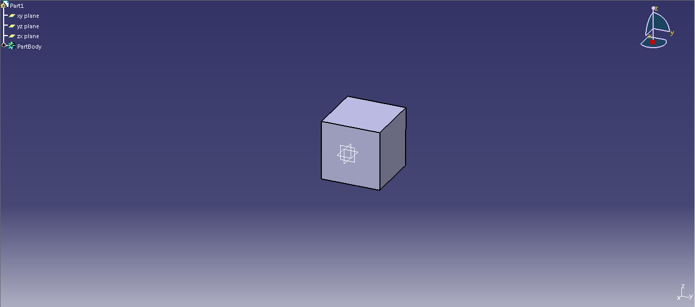
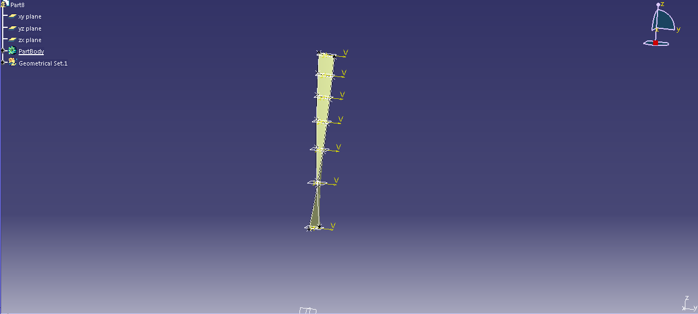

# [RICE](RICE)

> An API for easily automating creation 3D model using CATIA V5.
  RICE implements some operations to work with solids and surfaces.

# Table of contents
- [Installing / Getting started](#installing-getting-started)
- [Examples](#examples)
    - [Cube](#cube)
    - [Compressor blade](#compressor-blade)
- [Implemented operations](#implemented-operations>)
    - [Mechanical Design](#mechanical-design)
        - [Part Design](#part-design)
            - [Add body](#add-body)
            - [Pad](#pad)
            - [Pocket](#pocket)
            - [Sketch](#sketch)
                - [2D Line](#2d-line)
                - [Arc](#arc)
                - [Circle](#circle)
                - [Close path](#close-path)
                - [2D spline](#2d-spline)
                - [Arc by points](#arc-by-points)
                - [Constraints](#constraints)
    - [Shape](#shape)
        - [Generative Shape Design](#generative-shape-design)
            - [Fill](#fill)
            - [Join](#join)
    - [Common](#common)
        - [Create plane](#create-plane)
            - [Offset from plane](#offset-from-plane)
        - [3D line](#3d-line)
            - [Line Point to Point](#line-point-to-point)
        - [3D point](#3d-point)
            - [Point from cords](#point-from-cords)
        - [3D spline](#3d-spline)
        - [Create parameter](#create-parameter)
        - [Create relation](#create-relation)
            - [Formula](#formula)
        - [Save](#save)
        - [Export data](#export-data)
        
## Installing / Getting started

- Installing library:
    Download src folder and then install it via shell.
    ````shell
    python setup.py
    ````
    Then import it,
    ````python
    from Rice.application import Application
    ```` 
- Copying library:
    Download src folder and copy it to the root folder of your project. Then import it like a normal module.
    ````python
  from Rice.application import Application
    ````    
# Examples

- #### Cube


````python
from Rice.application import Application
import os

# Initializing connection with Catia
app = Application()

# Get created parts
parts = app.get_parts()
part = parts[0]

# Get created bodies
body = part.get_bodies()[0]

# Add a sketch on XY plane
sketch = body.add_sketch('xy')

# Add a close path to sketch
sketch.close_path([[0,0],[50,0],[50,50],[0,50]])

# Generating "Pad" operation with "sketch" and 50 mm height
pad = body.pad(sketch, 50)

# Save part, name.CatPART
part.save(os.path.join(os.path.abspath(''),'name'))
````
- #### Compressor blade



````python
from Rice.application import Application
import os
import pickle

# Getting blade geometry
f = open('blade_data', 'rb')
blade_data = pickle.load(f)
args=blade_data

# Initializing connection with Catia
app = Application()

# Get created parts
parts = app.get_parts()
part = parts[0]

# Get created bodies
body = part.get_bodies()[0]

# Formatting data
list_profiles_up = [args[i]['profile_UP'] for i in range(len(args)-1)]
list_profiles_down = [args[i]['profile_DOWN'] for i in range(len(args)-1)]
spline_extrados = list()
spline_intrados = list()
list_z = [args[i]['r'] for i in range(len(args)-1)]
for i, n, j in zip(list_profiles_up, list_profiles_down, list_z):
    
    # Creating plane
    plane = part.plane('Offset from plane', 'XY', j * 1000)
    
    # Adding sketch on "plane"
    sketch = body.add_sketch(plane)
    
    # Adding 2D spline to "sketch"
    spline = sketch.spline2D([[p[0] * 1000, p[1] * 1000] for p in i])
    spline_extrados.append(spline)
    
    # Adding sketch on "plane"
    sketch2 = body.add_sketch(plane)
    
    # Adding 2D spline to "sketch2"
    spline2 = sketch2.spline2D([[i[0][0]*1000, i[0][1]*1000]]+[[p[0] * 1000, p[1] * 1000] for p in n]+[[i[-1][0]*1000, i[-1][1]*1000]])
    spline_intrados.append(spline2)

# Creating leading edge spline
spline_delante = part.spline([[args[i]['profile_UP'][0][0]*1000, args[i]['profile_UP'][0][1]*1000, args[i]['r']*1000] for i in range(len(args)-1)])

# Creating trailing edge spline
spline_detas = part.spline([[args[i]['profile_UP'][-1][0]*1000, args[i]['profile_UP'][-1][1]*1000, args[i]['r']*1000] for i in range(len(args)-1)])
fill = list()

for i in range(len(spline_intrados)-1):
    objs = list()
    objs.append(spline_delante)
    objs.append(spline_intrados[i])
    objs.append(spline_detas)
    objs.append(spline_intrados[i+1])
    # Creating "fill"
    fill.append(part.fill(objs))
    objs = list()
    objs.append(spline_delante)
    objs.append(spline_extrados[i])
    objs.append(spline_detas)
    objs.append(spline_extrados[i + 1])
    # Creating "fill"
    fill.append(part.fill(objs))

part.update()

# Joining all the created surfaces
join = part.join(fill)
part.update()

# Exporting model with "stl" format, test.stl
part.export_data(os.path.abspath('')+r'\test','stl')
````

# Implemented operations

- ## Mechanical Design
    - ### Part Design
        - #### Add body
        ````python
        from Rice.application import Application
        
        # Initializing connection with CATIA
        app = Application()
        
        # Getting "parts" created. Once CATIA connection is enabled a part is created 
        # automatically.
        parts = app.get_parts()
        part = parts[0]
        
        # Adding "Body" to "part".
        part.add_body()
        # Getting created "bodies"
        bodies = part.get_bodies()
        ````
        - #### Pad
        ````python
        from Rice.application import Application
        
        # Initializing connection with CATIA
        app = Application()
        
        # Getting "parts" created. Once CATIA connection is enabled a part is created 
        # automatically.
        parts = app.get_parts()
        part = parts[0]
        
        # Getting "bodies". PartBody body is automatically created.
        body, = part.get_bodies()
    
        # Add a "sketch" on "XY" plane.
        sketch = body.add_sketch('XY')
        
        # Add a close path to sketch.
        sketch.close_path([[0,0],[50,0],[50,50],[0,50]])
        
        # Creating a "pad" 50 mm height from "sketch".
        body.pad(sketch, 50)
        ````
        - #### Pocket
        ````python
        from Rice.application import Application
        
        # Initializing connection with CATIA
        app = Application()
        
        # Getting "parts" created. Once CATIA connection is enabled a part is created 
        # automatically.
        parts = app.get_parts()
        part = parts[0]
        
        # Getting "bodies". PartBody body is automatically created.
        body, = part.get_bodies()
    
        # Add a "sketch" on "XY" plane.
        sketch = body.add_sketch('XY')
        
        # Add a close path to sketch.
        sketch.close_path([[0,0],[50,0],[50,50],[0,50]])
        
        # Creating a "pad" 50 mm height from "sketch".
        pad = body.pad(sketch, 50)
        
        # Creating a "sketch" on the upper face of the "pad".
        sketch2 = body.add_sketch(pad['up'])
        
        # Adding a circle with centre (25mm,25mm) and radius 10 mm.
        sketch2.circle([25,25], 10)
        
        # Creating a pocket from "sketch2".
        body.pocket(sketch2,10)
        ````
        - #### Sketch
            - ##### 2D Line
            ````python
            from Rice.application import Application
  
            # Initializing connection with CATIA
            app = Application()
            
            # Getting "parts" created. Once CATIA connection is enabled a part is created 
            # automatically.
            parts = app.get_parts()
            part = parts[0]
            
            # Getting "bodies". PartBody body is automatically created.
            body, = part.get_bodies()
        
            # Add a "sketch" on "XY" plane.
            sketch = body.add_sketch('XY')
            
            # Creating 2D line, (0,0) start point and (10,10) end point.
            sketch.line2D([0,0],[10,10])
            ````
            - ##### Arc
            ````python
            from Rice.application import Application
  
            # Initializing connection with CATIA
            app = Application()
            
            # Getting "parts" created. Once CATIA connection is enabled a part is created 
            # automatically.
            parts = app.get_parts()
            part = parts[0]
            
            # Getting "bodies". PartBody body is automatically created.
            body, = part.get_bodies()
        
            # Add a "sketch" on "XY" plane.
            sketch = body.add_sketch('XY')
            
            # Creating an arc with (0,0) centre, 20 mm radius and from 0 to 270 degrees.
            sketch.arc([0,0],20, 0, 270)
            ````
            - ##### Circle
            ````python
            from Rice.application import Application
  
            # Initializing connection with CATIA
            app = Application()
            
            # Getting "parts" created. Once CATIA connection is enabled a part is created 
            # automatically.
            parts = app.get_parts()
            part = parts[0]
            
            # Getting "bodies". PartBody body is automatically created.
            body, = part.get_bodies()
        
            # Add a "sketch" on "XY" plane.
            sketch = body.add_sketch('XY')
            
            # Creating a (0,0) center and 20mm radius circle
            sketch.circle([0,0],20)
            ````
            - ##### Close path
            ````python
            from Rice.application import Application
  
            # Initializing connection with CATIA
            app = Application()
            
            # Getting "parts" created. Once CATIA connection is enabled a part is created 
            # automatically.
            parts = app.get_parts()
            part = parts[0]
            
            # Getting "bodies". PartBody body is automatically created.
            body, = part.get_bodies()
        
            # Add a "sketch" on "XY" plane.
            sketch = body.add_sketch('XY')
          
            # Creating a close path with a list of points.
            sketch.close_path([[0,0],[10,0],[15,7.5],[15,15],[0,15]])
            ````
            - ##### 2D spline
            ````python
            from Rice.application import Application
  
            # Initializing connection with CATIA
            app = Application()
            
            # Getting "parts" created. Once CATIA connection is enabled a part is created 
            # automatically.
            parts = app.get_parts()
            part = parts[0]
            
            # Getting "bodies". PartBody body is automatically created.
            body, = part.get_bodies()
        
            # Add a "sketch" on "XY" plane.
            sketch = body.add_sketch('XY')
            
            # Add a spline 2D through a list of points.
            sketch.spline2D([[0,0],[10,0],[15,7.5],[15,15],[0,15]])
            ````
            - ##### Arc by points
            ````python
            from Rice.application import Application
  
            # Initializing connection with CATIA
            app = Application()
            
            # Getting "parts" created. Once CATIA connection is enabled a part is created 
            # automatically.
            parts = app.get_parts()
            part = parts[0]
            
            # Getting "bodies". PartBody body is automatically created.
            body, = part.get_bodies()
        
            # Add a "sketch" on "XY" plane.
            sketch = body.add_sketch('XY')
            
            sketch.arc_by_points([0,0],[10,0],20, 0)
            ````
            - ##### Constraints
            ````python
            from Rice.application import Application
  
            # Initializing connection with CATIA
            app = Application()
            
            # Getting "parts" created. Once CATIA connection is enabled a part is created 
            # automatically.
            parts = app.get_parts()
            part = parts[0]
            
            # Getting "bodies". PartBody body is automatically created.
            body, = part.get_bodies()
        
            # Add a "sketch" on "XY" plane.
            sketch = body.add_sketch('XY')
            
            # Generating close path
            lines = sketch.close_path([[0,0],[50,0],[50,50],[0,50]])          
            
            # Adding a Length constraint to the first line of "lines".
            const = sketch.set_constraint(5, lines[0])
            
            # Adding an Angle constraint between the first and the second line of "lines".
            const2 = sketch.set_constraint(6, lines[0], lines[1])
            ````
- ## Shape
    - ### Generative Shape Design
        - #### Fill
            ````python
            from Rice.application import Application
  
            # Initializing connection with CATIA
            app = Application()
            
            # Getting "parts" created. Once CATIA connection is enabled a part is created 
            # automatically.
            parts = app.get_parts()
            part = parts[0]
            
            # Getting "bodies". PartBody body is automatically created.
            body, = part.get_bodies()
        
            # Add a "sketch" on "XY" plane.
            sketch = body.add_sketch('XY')
            
            # Creating spline 2D on "sketch"
            sketch.spline2D([[0, 15], [5, 10], [10, 5], [20, 15]])
            
            # Creating 3D lines.
            line1 = part.line3D([0, 15, 0], [0, 15, 15])
            line2 = part.line3D([20, 15, 0], [20, 15, 15])
            line3 = part.line3D([0, 15, 15], [20, 15, 15])
            
            # Join with a surface "line1", "sketch", "line2" and "line3".
            part.fill([line1, sketch, line2, line3])
            ````
        - #### Join
            ````python
            from Rice.application import Application
            
            # Initializing connection with CATIA
            app = Application()
            
            # Getting "parts" created. Once CATIA connection is enabled a part is created 
            # automatically.
            parts = app.get_parts()
            part = parts[0]
            
            # Getting "bodies". PartBody body is automatically created.
            body, = part.get_bodies()
        
            # Add a "sketch" on "XY" plane.
            sketch = body.add_sketch('XY')
            
            # Creating spline 2D on "sketch"
            sketch.spline2D([[0, 15], [5, 10], [10, 5], [20, 15]])
            
            # Creating 3D lines.
            line1 = part.line3D([0, 15, 0], [0, 15, 15])
            line2 = part.line3D([20, 15, 0], [20, 15, 15])
            line3 = part.line3D([0, 15, 15], [20, 15, 15])
            
            # Join with a surface "line1", "sketch", "line2" and "line3".
            fill1 = part.fill([line1, sketch, line2, line3])
            
            # Creating sketch on 'XY' plane
            sketch2 = body.add_sketch('xy')
            
            # Creating spline 2D on "sketch2"
            sketch2.spline2D([[0, 15], [5, 20], [10, 25], [20, 15]])
            
            # Join with a surface "line1", "sketch2", "line2" and "line3".
            fill2 = part.fill([line1, sketch2, line2, line3])
          
            # Joining surface "fill1" and "fill2".
            part.join([fill1, fill2])
            ````
- ## Common
    - ### Create plane
        - #### Offset from plane
            ````python
            from Rice.application import Application
  
            # Initializing connection with CATIA
            app = Application()
            
            # Getting "parts" created. Once CATIA connection is enabled a part is created 
            # automatically.
            parts = app.get_parts()
            part = parts[0]
            
            # Getting "bodies". PartBody body is automatically created.
            body, = part.get_bodies()
            
            # Creating 20 mm offset plane from 'XY' plane.
            plane = part.plane('Offset from plane', 'xy', 20)
            ````
        - TO-DO
    - #### 3D line
        - ##### Line Point to Point
        ````python
        from Rice.application import Application
  
        # Initializing connection with CATIA
        app = Application()
        
        # Getting "parts" created. Once CATIA connection is enabled a part is created 
        # automatically.
        parts = app.get_parts()
        part = parts[0]
        
        # Getting "bodies". PartBody body is automatically created.
        body, = part.get_bodies()
        
        # Creating 3D line.
        part.line3D([0,0,0], [10,20,50])
        ````
        - TO-DO
    - #### 3D point
        - ##### Point from cords
        ````python
        from Rice.application import Application
  
        # Initializing connection with CATIA
        app = Application()
        
        # Getting "parts" created. Once CATIA connection is enabled a part is created 
        # automatically.
        parts = app.get_parts()
        part = parts[0]
        
        # Getting "bodies". PartBody body is automatically created.
        body, = part.get_bodies()
        
        # Creating 3D point.
        part.point3D([0,0,0])
        ````
        - TO-DO
    - #### 3D Spline
        ````python
        from Rice.application import Application
  
        # Initializing connection with CATIA
        app = Application()
        
        # Getting "parts" created. Once CATIA connection is enabled a part is created 
        # automatically.
        parts = app.get_parts()
        part = parts[0]
        
        # Getting "bodies". PartBody body is automatically created.
        body, = part.get_bodies()
        
        # Creating 3D spline.
        part.spline([[0,0,0], [5,5,7], [10,5,15]])
        ````
    - #### Create parameter
    ````python
    from Rice.application import Application

    # Initializing connection with CATIA
    app = Application()
    
    # Getting "parts" created. Once CATIA connection is enabled a part is created 
    # automatically.
    parts = app.get_parts()
    part = parts[0]
    
    # Getting "bodies". PartBody body is automatically created.
    body, = part.get_bodies()
    
    # Creating a real parameter called "Parameter1" with 50m initial value
    param = part.create_param('real', "Parameter1", 50)
    ````
    - #### Create relation
        - ##### Formula
        ````python
        from Rice.application import Application
  
        # Initializing connection with CATIA
        app = Application()
        
        # Getting "parts" created. Once CATIA connection is enabled a part is created 
        # automatically.
        parts = app.get_parts()
        part = parts[0]
        
        # Getting "bodies". PartBody body is automatically created.
        body, = part.get_bodies()
        
        # Creating 20 mm offset plane from 'XY' plane.
        plane = part.plane('Offset from plane', 'xy', 20)
        
        # Creating a real parameter called "Parameter1" with 0.03m initial value
        param = part.create_param('real', "Parameter1", 0.03)
        
        # Setting up a formula to set plane offset equal to two times the "Parameter1" value.
        part.create_formula('formula1', plane.offset(), '{}*2'.format(param.name))   
        ````
        - TO-DO
    - #### Save
    ````python
    from Rice.application import Application
    import os
    
    # Initializing connection with Catia
    app = Application()
    
    # Get created parts
    parts = app.get_parts()
    part = parts[0]
    
    # Get created bodies
    body = part.get_bodies()[0]
    
    # Add a sketch on XY plane
    sketch = body.add_sketch('xy')
    
    # Add a close path to sketch
    sketch.close_path([[0,0],[50,0],[50,50],[0,50]])
    
    # Generating "Pad" operation with "sketch" and 50 mm height
    pad = body.pad(sketch, 50)
    
    # Save part, name.CatPART
    part.save(os.path.join(os.path.abspath(''),'name'))
    ````
    - #### Export data
    ````python
    from Rice.application import Application
    import os
    
    # Initializing connection with Catia
    app = Application()
    
    # Get created parts
    parts = app.get_parts()
    part = parts[0]
    
    # Get created bodies
    body = part.get_bodies()[0]
    
    # Add a sketch on XY plane
    sketch = body.add_sketch('xy')
    
    # Add a close path to sketch
    sketch.close_path([[0,0],[50,0],[50,50],[0,50]])
    
    # Generating "Pad" operation with "sketch" and 50 mm height
    pad = body.pad(sketch, 50)
    
    # Save part as "stl" format, name.stl
    part.export_data(os.path.join(os.path.abspath(''),'name'),"stl")
    ````